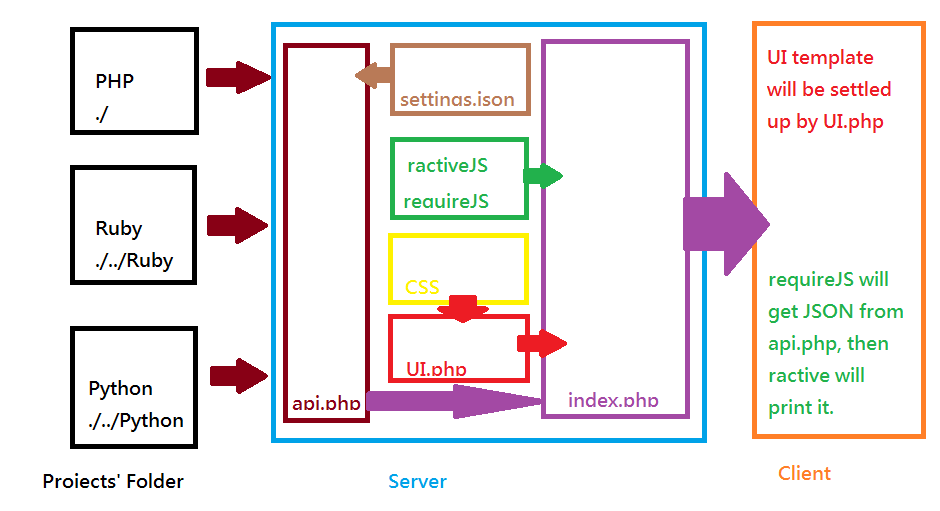

Local-Server-Page
=================

A Page which will show the local server status and projects.

Model
----



If this CSS framework need jQuery, we'll let UI.php render the following thing.

```html
    <script src="assets/javascript/jquery.min.js"></script>
    <script src="assets/javascript/library/{{framework}}.js">
    <script>jQuery.noconflict()</script>
    <!-- {{framework}} will be replace the framework name you use. -->
```

Then CSS will use "jQuery" to run its dynamic effects.

Progress
----

- [x] setting.example.json Created.
- [x] api.php Complete.
- [x] requireJS, ractiveJS structure Complete.
- [x] UI.php Complete.
- [x] CSS, template Complete (only Bootstrap).
- [x] index.php calling complete.
- [ ] install.php complete
- [ ] output api document

Setup
----

Just on your server and open this page.

If you haven't initialize your settings.json, it will redirect you to install.php to setup the parameters.

After settled up the page. You can setup the root index.php to the following type.

```php
<?php
	if (!empty($_SERVER['HTTPS']) && ('on' == $_SERVER['HTTPS'])) {
		$uri = 'https://';
	} else {
		$uri = 'http://';
	}
	$uri .= $_SERVER['HTTP_HOST'];
	header('Location: '.$uri.'/Local-Server-Page');
	exit;
?>
```

Contribution
----

You can contribute us by developing our api.php or UI.php.

To make it more elegant for user to use.

Use issue and pull request to tell me your better method.